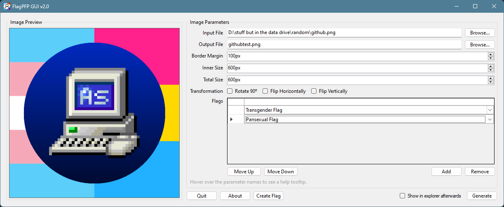
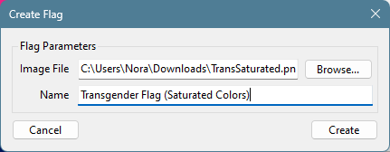

# FlagPFP GUI

GUI frontend for [FlagPFP](https://github.com/AestheticalZ/FlagPFP), with [FlagPFP.Core](https://github.com/AestheticalZ/FlagPFPCore) integrated.

Includes 14 built-in flags, with the option to add your own with an integrated flag creator utility. Supports multiple flags per image!

## Why was FlagPFP.Core integrated?
Due to compatibility issues with Newtonsoft.Json and NET Standard 2.0, I decided to integrate the code into the windows forms app, which is .NET Framework 4.8-based.

## Building
Open the .sln file in VS2022 and select Debug or Release, then build it.

⚠️ **WARNING** ⚠️ :: Needs libwebp named as "libwebp_x64.dll" in the same directory as the executable. Get libwebp [here](https://github.com/webmproject/libwebp).

# Program Screenshot

