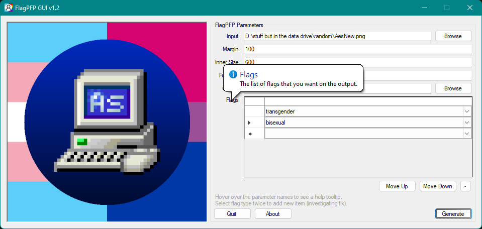

# FlagPFP GUI
GUI for [FlagPFP](https://github.com/AestheticalZ/FlagPFP), with FlagPFP.Core (soon to be uploaded to github) integrated.

Now supports a large number of flags in the same image!

## Why was FlagPFPCore integrated?
Due to compatibility issues with Newtonsoft.Json and NET Standard 2.0, I decided to integrate the code into the windows forms app, which is .NET Framework 4.7.2

## Building
Open the .sln file in VS2019 and build for Debug/Release, then copy the "Flags" and "Flag JSONs" folder to the directory of the executable.

# How the program looks:

